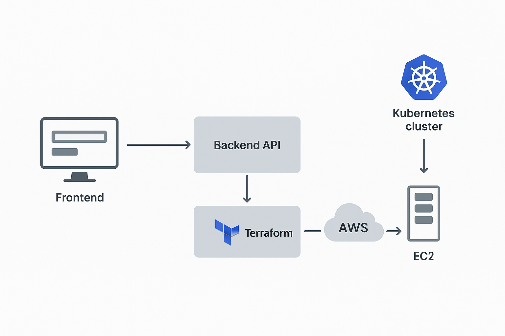

# kaas-platform
Building kubernetes as service on AWS

🧠 Example in Real Time

Imagine you open the dashboard and input:

Cluster Name: demo-cluster  
Region: us-east-1  
Nodes: 2  
Instance Type: t3.medium  

Clicking “Create Cluster” will:  

Trigger an API call to FastAPI → POST /api/clusters

Backend executes Terraform:  

    Creates VPC, Subnet, Security Group  
    
    Launches one master + two worker EC2s  
    
    Runs bootstrap script installing containerd, kubeadm, kubectl  
    
    Once cluster is ready, API returns success and UI shows “Cluster Running”.  
